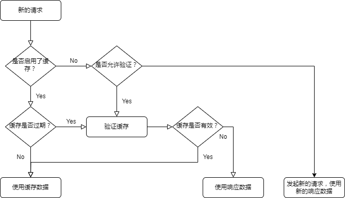

# 前言

之前详细的看过《图解http》、《http权威指南》等等http相关书籍，其中也涉及到了http缓存，自然是很快的被遗忘了。

和很多计算机技术一样，没有实际的应用场景，看书的学习效率确实较低。

# http缓存

http缓存涉及到的内容较多的，这里根据自己的实际应用场景，来构建对http缓存的认知。

# 基本模型



可以将浏览器的缓存策略归纳为3种：

- `Cache-Control: must-revalidate`，默认策略，启用了缓存
- `Cache-Control: no-cache`，允许验证
- `Cache-Control：no-store`，禁止缓存

浏览器在接收到响应数据后，下次再对同一资源发起请求时，根据不同策略及条件，可能会做出以下行为之一：

- 直接从本地或者内存中取上一次的响应数据，作为当前请求的响应数据
- 向服务器发起一次请求，验证上一次的响应数据是否过期，如果没有过期使用上一次的响应数据，否则服务器会返回新的响应数据
- 向服务器发起新的请求

>目前仅知道get类型的请求会受到缓存影响，其它请求类型不确定

## 启用了缓存

注意这里的说法很容易让人产生误解，事实上，允许验证缓存也是使用到了缓存。一些中文博客也称这种方式为**强缓存**。

以下情况会启用缓存：

- 请求头与值：`Cache-Control: max-age=604800`，`max-age`的值应当是一个有效的正值，可以认为省略了`must-revalidate`
- 请求头与值：`Cache-Control: must-revalidate`，当缓存陈旧后，需要验证缓存，一般配合`max-age`使用，如`Cache-Control: max-age=604800, must-revalidate`
- [启发式缓存](https://developer.mozilla.org/en-US/docs/Web/HTTP/Caching#heuristic_caching)，尽管未设置`Cache-Control`响应头，但浏览器会根据其它头信息，默认使用缓存

在缓存**新鲜**期间，浏览器会使用缓存，而不进行请求。

>新鲜和陈旧是用来描述缓存是否过期的术语

### 缓存是否过期

有两种定义缓存有效期的方式：

```
Expires: Fri, 05 Jul 2002, 05:00:00 GMT
Cache-Control: max-age=604800
```

这是因为http版本更新的原因，`Expires`是http1.0的头信息，其值是一个绝对时间值，由于存在时钟误差等原因，绝对值被认为是不好的设计。

`max-age`是http1.1定义的，使用的是一个相对值（秒），精确的时间锚点是服务端时间，但是客户端只能使用客户端时间进行验证。

### 例外：刷新和强制刷新

当用户刷新时，浏览器会通过如下方式验证缓存是否有效：

```
GET / HTTP/1.1
Host: example.com
Cache-Control: max-age=0
If-None-Match: "deadbeef"
If-Modified-Since: Tue, 22 Feb 2022 20:20:20 GMT
```

当用户强制刷新(ctrl+f5)时，浏览器会通过如下方式验证缓存是否有效：

```
GET / HTTP/1.1
Host: example.com
Pragma: no-cache
Cache-Control: no-cache
```

**刷新和强制刷新来要求验证缓存有效性存在严重的缺陷：**

- 需要用户介入，导致用户存在心智负担
- 浏览器会跳过对资源文件的验证

## 允许验证

`no-cache`是存在歧义的值，它的真实含义是每次都需要验证缓存有效后，才能使用缓存。

服务端返回如下响应头，表示资源允许验证：

```
Pragma: no-cache
Cache-Control: no-cache
```

`Pragma`是http1.0时代的头，`no-cache`是其唯一值，`Pragma: no-cache`与`Cache-Control: no-cache`等价，只用于兼容http1.0。

### 验证的方式

服务端在响应数据时，会返回两个响应头（意味着有两种验证方式）：

```
Last-Modified: Tue, 22 Feb 2022 20:20:20 GMT
ETag: YsAIAAAA-QG4G6kCMAMBAAAAAAAoK
```

`Last-Modified` 记录的是服务端上次修改文件的时间，`ETag` 记录的是文件的版本标志符。

当客户端要求验证缓存是否新鲜时，如果缓存是新鲜的，服务器返回`304`响应，表示缓存有效，如果启用了缓存，服务端应当刷新缓存有效期。否则服务器返回正常的响应。

#### Last-Modified&If-Modified-Since

客户端使用`If-Modified-Since`来携带`Last-Modified`的值，要求服务器进行验证。

#### ETag&If-None-Match

客户端使用`If-None-Match`来携带`ETag`的值，要求服务端进行验证。

ETag存在两种格式：

```
ETag: W/"<etag_value>"
ETag: "<etag_value>"
```

这两种被区分为`弱验证器`，`强验证器`。某些场景，文件做了部分更新，但是语义未变化（版本兼容），弱验证器就是用于这种情况。而强验证器只要文件更新，就需要更新。

#### 两种验证方式的优先级

《http权威指南》认为两种验证方式需要同时验证，只有两者都通过才能证明缓存有效。

[RFC7232](https://datatracker.ietf.org/doc/html/rfc7232#section-6)认为`Etag`的优先级高于`Last-Modified`。Go的`http.FileServer()`遵循该RFC。

# 禁止缓存

`Cache-Control: no-store`请求头会禁止缓存，要求每次请求必须使用最新的服务端响应。

# 最佳实践

## 显示设置缓存策略，避免启发式缓存

启发式缓存就是启用缓存，但是由于`刷新与强制刷新`存在的弊端，启用缓存时，在缓存有效期内，服务端很难对客户端版本进行更新，BUG会迟迟无法修复，造成严重的损失。

html页面应当避免启用缓存，因为html页面与URL存在关联，HTML的URL应当是简洁、清晰的，这意味着`将版本或者hash嵌入文件名`不适用html文件，`将版本或者hash嵌入查询参数`同样不适用于html文件，这是因为对于html的URL而言，查询参数是重要的部分，不应该滥用于缓存目的。

资源文件允许启用缓存，但必须进行`版本化`或者`hash化`。

## 使用版本化和哈希化规避启用缓存的缺陷

启用缓存是效率最高的缓存策略，但同时存在较大的弊端，可以使用版本化/哈希化来规避这种弊端。

版本化/哈希化是将版本信息/哈希值嵌入文件名或者查询路径中：

```
# version in filename
bundle.v123.js

# version in query
bundle.js?v=123

# hash in filename
bundle.YsAIAAAA-QG4G6kCMAMBAAAAAAAoK.js

# hash in query
bundle.js?v=YsAIAAAA-QG4G6kCMAMBAAAAAAAoK
```

对于资源文件，因为其URL一般对用户隐藏，其查询参数通常不被使用，因此这种方式是合理的。

资源文件的加载路径的root是html文件，只要html文件没有启用缓存，那么更新html文件就能实现对资源文件的更新。

# 参考资料

[MDN: HTTP caching](https://developer.mozilla.org/en-US/docs/Web/HTTP/Caching)

《http权威指南》第7章