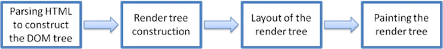

# 前言
本文是Tali Garsiel写于2009年的 [how browsers work]((http://taligarsiel.com/Projects/howbrowserswork1.htm)) 的阅读笔记，后由Google的员工在2011年进一步[整理](https://web.dev/howbrowserswork/)。

虽然已经过去了10多年，但是因为html5规范规定了浏览器应当怎样处理页面，因此本文的内容依然还有很大的参考价值。

# 基本流程
浏览器在显示一个页面时其基本流程如下：

解析HTML得到DOM树；根据HTML中的样式属性、内联样式、样式表构建渲染树；根据渲染树进行布局；最后渲染。

>浏览器在下载HTML文件时，就开始预处理，得到外部资源文件并进行下载

# 脚本和样式表对于流程的影响

## 脚本
对于非`defer`,`async`的脚本，当解析到脚本时，需要暂停构建DOM树，下载脚本并执行脚本。这是因为脚本的执行将可能改变DOM，因此要求采取顺序执行模型。

### 优化：推测性解析
虽然没法继续构建DOM树，但可以并行解析HTML获取其中的外部资源，实现在下载执行脚本时，并行下载外部资源。

并行下载能力是有限的，浏览器的网络连接并行上限通常<=6。

## 样式表
渲染树的构建与DOM树的构建是同时进行的，但是渲染树的构建有时会干扰到DOM树的构建。

因为脚本可能需要访问样式信息，因此当样式表加载和渲染时，浏览器可能会暂停脚本的执行，从而进一步推迟了DOM树的构建。

