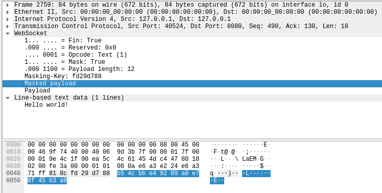
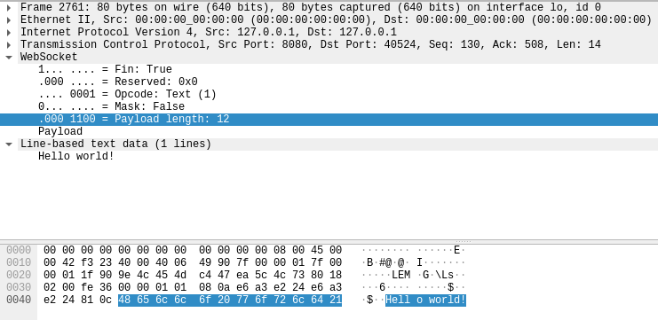
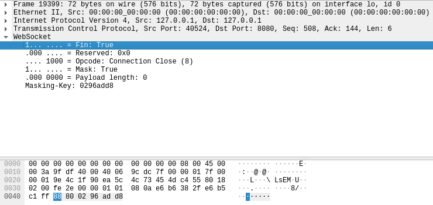
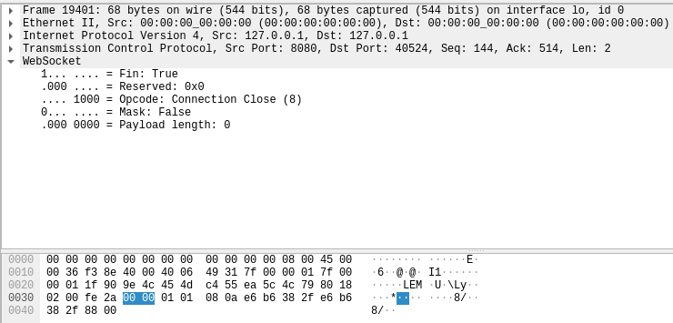

这里以一个简单的[echo](https://github.com/gorilla/websocket/tree/master/examples/echo)服务为例：

# 握手

客户端：

```
GET /echo HTTP/1.1
Host: localhost:8080
Connection: Upgrade
Pragma: no-cache
Cache-Control: no-cache
User-Agent: Mozilla/5.0 (X11; Linux x86_64) AppleWebKit/537.36 (KHTML, like Gecko) Chrome/85.0.4183.121 Safari/537.36
Upgrade: websocket
Origin: http://localhost:8080
Sec-WebSocket-Version: 13
Accept-Encoding: gzip, deflate, br
Accept-Language: en-US,en;q=0.9
Sec-WebSocket-Key: m9+dYQus7JeQnvcLGQbrGg==
Sec-WebSocket-Extensions: permessage-deflate; client_max_window_bits
```


服务端：

```
HTTP/1.1 101 Switching Protocols
Upgrade: websocket
Connection: Upgrade
Sec-WebSocket-Accept: o5hzvsCRA8f7CCkw7O2mxrI7KKY=
```

# 通信

客户端发送如下：



服务端响应如下：



可以看到WebSocket使用了**成帧机制**，帧头很短，只使用了两个字节包括：


- Fin

- Resvered 保留位

- Opcode 操作码，通信时使用两种：文本消息、二进制消息

- Ｍask 是否使用掩码

- Payload length 负载长度


在使用掩码时会附加一个固定长度的掩码，后续的所有负载使用掩码进行了编码，接收者需要进行解码处理。

# 断开

客户端断开连接请求：




服务端响应：

